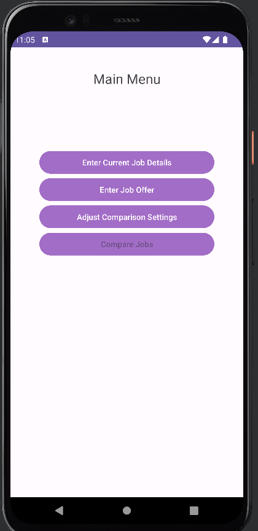
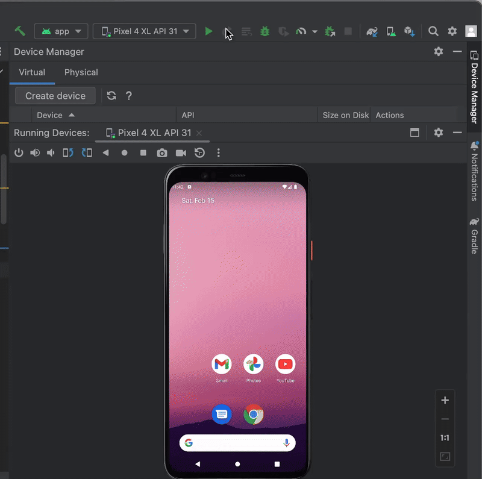

# code_sample
 this is the code sample for potential interview by Ruiqing Wang. 
 
 ## Job Compare 
JobCompare is an Android application designed to help users evaluate and compare job offers based on multiple financial and non-financial factors. The app provides a structured way to input job-related details, such as salary, bonuses, benefits, and cost of living, to make informed career decisions.

This project follows Android development best practices and includes both frontend and backend components. The application is built to run on Android 12+ devices and is designed for mobile phones only. All data is stored client-side to ensure offline access and quick retrieval.

To ensure reliability, the project includes unit tests and Android tests, validating core functionalities and UI behaviors. Given the development timeline constraints, simplicity and efficiency were prioritized in the design and implementation.
### Application preview
Here is the main menu screen: 

Here is the short video on running this app: 

